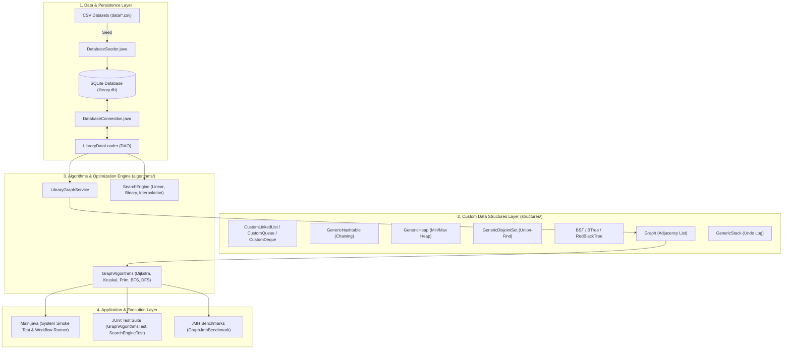

# 📚 Library Service Operations Optimizer

[](https://www.oracle.com/java/)
[](https://www.sqlite.org/)
[](https://junit.org/)
[](https://github.com/openjdk/jmh)
[]()

An enterprise-grade, algorithmically rigorous Java operations optimization system designed for modern university libraries (modeled on the **Balme Library** spatial layout). The system manages inventory, coordinates automated book cart dispatch and personnel navigation, optimizes physical IT network cabling, schedules service requests, and maintains an auditable stack-based transaction history.

---

## 📑 Table of Contents

- [Key Highlights](#-key-highlights)
- [System Architecture](#-system-architecture)
- [Database & Relational Model](#-database--relational-model)
- [Custom Data Structures Suite](#-custom-data-structures-suite)
- [Algorithms & Optimization Engine](#-algorithms--optimization-engine)
- [Project Directory Structure](#-project-directory-structure)
- [Getting Started & Setup](#-getting-started--setup)
- [Testing & Benchmarking](#-testing--benchmarking)
- [Formal Proofs & Trace Tables](#-formal-proofs--trace-tables)

---

## 🌟 Key Highlights

* **Zero Standard Java Collections for Core Logic:** All underlying algorithmic operations strictly utilize custom-built, generic data structures (`CustomLinkedList`, `GenericHeap`, `GenericHashtable`, `GenericDisjointSet`, `RedBlackTree`, `BTree`, `Graph`, etc.) without relying on `java.util.*` collection classes.
* **Realistic Spatial Modeling:** Library corridors are modeled as a weighted graph $G=(V, E)$ accounting for physical distance, floor transitions (elevators/stairs), and corridor friction coefficients ($\mu$).
* **Shortest Path Cart Dispatch:** Dijkstra's Algorithm finds cost-optimal delivery paths for autonomous carts and staff navigation.
* **Network Topology Optimization:** Kruskal's and Prim's Minimum Spanning Tree (MST) algorithms compute cycle-free, minimum-cost cable layouts for RFID tracking infrastructure.
* **Relational Persistence & Integrity:** Backed by an ACID-compliant SQLite relational schema enforcing foreign key cascades, check constraints, and performance indexes.
* **Defensive Search & Precondition Validation:** Linear, Binary, and Interpolation search algorithms fortified with runtime sortedness checks (`UnsortedDataException`).
* **Stack-Based Audit & Undo Engine:** Transactional state mutations push snapshots to an audit stack, allowing reliable multi-level rollback operations.

---

## 🏛 System Architecture



---

## 🗄 Database & Relational Model

The database layer consists of **10 interconnected tables** defined in [`src/main/resources/schema.sql`](src/main/resources/schema.sql) with strict foreign key constraints and validation rules:

| Table | Description | Key Attributes / Constraints |
| :--- | :--- | :--- |
| `locations` | Physical nodes (desks, shelves, entrances, rooms) | `location_id`, `name`, `area`, `type CHECK IN ('SHELF','DESK','ROOM','ENTRANCE','STAFF_ROOM')` |
| `roads` | Corridor edges connecting locations | `road_id`, `from_location_id`, `to_location_id`, `distance`, `travel_time`, `road_condition_weight` |
| `members` | Library patrons and staff | `member_id`, `index_number UNIQUE`, `name`, `membership_type CHECK IN ('STUDENT','STAFF','FACULTY')` |
| `books` | Catalog of cataloged literature and shelf links | `book_id`, `isbn`, `title`, `author`, `category`, `shelf_location_id` |
| `service_requests` | Service queue (borrow, return, renew, reserve) | `request_id`, `member_id`, `book_id`, `source_location_id`, `destination_location_id`, `urgency`, `status` |
| `issue_logs` | Historical record of completed loans & fines | `issue_log_id`, `request_id`, `book_id`, `member_id`, `issue_date`, `due_date`, `fine_amount` |
| `resources` | Automated book carts, staff, and kiosks | `resource_id`, `type CHECK IN ('STAFF','CART','KIOSK')`, `home_location_id`, `availability_status` |
| `algorithm_runs` | Empirical execution benchmarks & telemetry | `run_id`, `algorithm_name`, `input_size`, `time_ns`, `memory_kb`, `date_run` |
| `audit_events` | Immutable mutation journal for undo tracking | `event_id`, `event_type CHECK IN ('ISSUE','RETURN','REQUEST_CREATED','REQUEST_CANCELLED','UNDO')`, `is_undone` |
| `algorithm_parameters` | Anti-plagiarism traceability parameters | `param_id`, `member_index_number`, `param_name`, `derived_value`, `derivation_note` |

---

## 🧩 Custom Data Structures Suite

All data structures are implemented from first principles in the [`structures`](src/main/java/structures/) package:

| Data Structure | Implementation File | Key Operations & Complexity | Use Case in Project |
| :--- | :--- | :--- | :--- |
| **Doubly Linked List** | [`CustomLinkedList.java`](src/main/java/structures/CustomLinkedList.java) | Insert $O(1)$, Delete $O(1)$, Access $O(n)$ | Adjacency lists, traversal paths, search outputs |
| **FIFO Queue** | [`CustomQueue.java`](src/main/java/structures/CustomQueue.java) | `enqueue` $O(1)$, `dequeue` $O(1)$ | Breadth-First Search (BFS) corridor exploration |
| **Circular Queue** | [`CircularQueue.java`](src/main/java/structures/CircularQueue.java) | `enqueue` $O(1)$, `dequeue` $O(1)$, Fixed memory | Buffer management and bounded task queues |
| **Double-Ended Queue** | [`CustomDeque.java`](src/main/java/structures/CustomDeque.java) | `addFirst`/`addLast` $O(1)$, `removeFirst`/`removeLast` $O(1)$ | Bidirectional search and prioritized buffering |
| **Min/Max Binary Heap** | [`GenericHeap.java`](src/main/java/structures/GenericHeap.java) | `insert` $O(\log n)$, `extractMin` $O(\log n)$, `peek` $O(1)$ | Priority queue for Dijkstra and Prim algorithms |
| **Hash Table** | [`GenericHashtable.java`](src/main/java/structures/GenericHashtable.java) | `put` $O(1)$ avg, `get` $O(1)$ avg, Separate Chaining | Vertex lookup, visited tracking, distance mapping |
| **Disjoint Set (Union-Find)** | [`GenericDisjointSet.java`](src/main/java/structures/GenericDisjointSet.java) | `find` $O(\alpha(n))$, `union` $O(\alpha(n))$ with Path Compression | Cycle detection in Kruskal's MST algorithm |
| **Stack** | [`GenericStack.java`](src/main/java/structures/GenericStack.java) | `push` $O(1)$, `pop` $O(1)$, `peek` $O(1)$ | Depth-First Search (DFS) & Audit Event Undo stack |
| **Graph (Adjacency List)** | [`Graph.java`](src/main/java/structures/Graph.java) | `addVertex` $O(1)$, `addEdge` $O(1)$, `getNeighbors` $O(1)$ | Balme Library physical spatial network model |
| **Binary Search Tree** | [`BST.java`](src/main/java/structures/BST.java) | Search $O(\log n)$ avg, Insert $O(\log n)$, Traversal | Hierarchical indexing of service requests |
| **Red-Black Tree** | [`RedBlackTree.java`](src/main/java/structures/RedBlackTree.java) | Search, Insert, Delete $O(\log n)$ guaranteed | Balanced book catalog indexing |
| **B-Tree** | [`BTree.java`](src/main/java/structures/BTree.java) | Search, Insert $O(\log n)$ disk-friendly multiway tree | High-density secondary storage indexing |

---

## ⚡ Algorithms & Optimization Engine

### 1. Spatial Routing & Graph Algorithms ([`GraphAlgorithms.java`](src/main/java/algorithms/GraphAlgorithms.java))

* **Dijkstra's Shortest Path:** Computes lowest-cost delivery route between library nodes.
  $$\text{Effective Weight } w(e) = d_e \times \mu_e$$
  where $d_e$ is physical distance in meters and $\mu_e$ is corridor friction (stairs, congestion, doorways).
* **Kruskal's Algorithm:** Computes Minimum Spanning Tree using edge sorting and `GenericDisjointSet` with union-by-rank and path compression ($O(|E| \log |E|)$).
* **Prim's Algorithm:** Computes Minimum Spanning Tree using vertex cut relaxation via `GenericHeap` ($O(|E| \log |V|)$).
* **BFS & DFS:** Multi-level reachability verification, component connectivity, and cycle inspection.

### 2. Search Engine & Defensive Validation ([`SearchEngine.java`](src/main/java/algorithms/SearchEngine.java))

* **Linear Search:** Unordered fallback for arbitrary entity scans ($O(n)$).
* **Binary Search:** High-speed divide-and-conquer on sorted lists ($O(\log n)$).
* **Interpolation Search:** Adaptive numerical position estimation on uniformly distributed request IDs ($O(\log \log n)$ average).
* **Defensive Sortedness Checks:** Algorithms enforce ordering preconditions, throwing `UnsortedDataException` to prevent silent logic errors.

---

## 📂 Project Directory Structure

```text
Library-Service-Optimizer/
├── .classpath                          # Eclipse / VS Code Java build configuration
├── .gitignore                          # Build artifacts & binary ignore rules
├── data/                               # CSV seed datasets (10 relational entities)
│   ├── algorithm parameters.csv
│   ├── algorithm_runs.csv
│   ├── audit_events.csv
│   ├── books.csv
│   ├── issue_logs.csv
│   ├── locations.csv
│   ├── members.csv
│   ├── resources.csv
│   ├── roads.csv
│   └── service_requests.csv
├── docs/                               # Formal mathematical proofs & analysis
│   └── graph.md                        # Trace tables, invariant proofs & counterexamples
├── lib/                                # Standalone JAR dependencies
│   ├── commons-math3-3.6.1.jar
│   ├── hamcrest-core-1.3.jar
│   ├── jmh-core-1.37.jar
│   ├── jmh-generator-annprocess-1.37.jar
│   ├── jopt-simple-5.0.4.jar
│   └── junit-4.13.2.jar
├── sqlite-jdbc-3.36.0.3.jar            # SQLite JDBC driver
├── src/
│   └── main/
│       ├── java/
│       │   ├── algorithms/             # Graph algorithms, Search engine, JMH benchmarks
│       │   │   ├── GraphAlgorithms.java
│       │   │   ├── GraphAlgorithmsTest.java
│       │   │   ├── GraphJmhBenchmark.java
│       │   │   ├── LibraryGraphService.java
│       │   │   ├── SearchEngine.java
│       │   │   └── SearchEngineTest.java
│       │   ├── library/                # Main entry point & application logic
│       │   │   ├── Main.java
│       │   │   ├── db/                 # JDBC connection, seeding, and DAO loader
│       │   │   │   ├── DatabaseConnection.java
│       │   │   │   ├── DatabaseSeeder.java
│       │   │   │   └── LibraryDataLoader.java
│       │   │   └── model/              # Domain entity models (POJOs)
│       │   │       ├── AlgorithmParameter.java
│       │   │       ├── AlgorithmRun.java
│       │   │       ├── AuditEvent.java
│       │   │       ├── Book.java
│       │   │       ├── IssueLog.java
│       │   │       ├── Location.java
│       │   │       ├── Member.java
│       │   │       ├── Resource.java
│       │   │       ├── Road.java
│       │   │       └── ServiceRequest.java
│       │   └── structures/             # Custom generic data structures
│       │       ├── BST.java
│       │       ├── BTree.java
│       │       ├── CircularQueue.java
│       │       ├── CustomDeque.java
│       │       ├── CustomLinkedList.java
│       │       ├── CustomQueue.java
│       │       ├── GenericDisjointSet.java
│       │       ├── GenericHashtable.java
│       │       ├── GenericHeap.java
│       │       ├── GenericStack.java
│       │       ├── Graph.java
│       │       └── RedBlackTree.java
│       └── resources/
│           └── schema.sql              # DDL schema definition & performance indexes
└── README.md
```

---

## 🚀 Getting Started & Setup

### Prerequisites

* **Java Development Kit (JDK):** Version 11 or higher.
* **IDE:** VS Code with Java Extension Pack, IntelliJ IDEA, or Eclipse.
* **Operating System:** Windows, macOS, or Linux.

### 1. Clone the Repository

```bash
git clone https://github.com/ata-ug/Library-Service-Optimizer.git
cd Library-Service-Optimizer
```

### 2. Compile the Project

Compile using `javac` including all library dependencies:

```bash
# Windows PowerShell
javac -cp "sqlite-jdbc-3.36.0.3.jar;lib/*;src/main/resources" -d bin (Get-ChildItem -Recurse -Filter *.java src/main/java).FullName

# Linux / macOS
javac -cp "sqlite-jdbc-3.36.0.3.jar:lib/*:src/main/resources" -d bin $(find src/main/java -name "*.java")
```

### 3. Initialize & Seed Database

Populate `library.db` from the CSV datasets in `data/`:

```bash
# Windows PowerShell
java -cp "bin;sqlite-jdbc-3.36.0.3.jar;src/main/resources" library.db.DatabaseSeeder

# Linux / macOS
java -cp "bin:sqlite-jdbc-3.36.0.3.jar:src/main/resources" library.db.DatabaseSeeder
```

### 4. Run the Application Smoke Test

Execute `Main.java` to verify the full DAO pipeline and JDBC connectivity:

```bash
# Windows PowerShell
java -cp "bin;sqlite-jdbc-3.36.0.3.jar;src/main/resources" library.Main

# Linux / macOS
java -cp "bin:sqlite-jdbc-3.36.0.3.jar:src/main/resources" library.Main
```

---

## 🧪 Testing & Benchmarking

### Running Unit Tests (JUnit 4)

Execute the formal test suites covering graph routing, connectivity, and search algorithms:

```bash
# Windows PowerShell
java -cp "bin;lib/*;sqlite-jdbc-3.36.0.3.jar" org.junit.runner.JUnitCore algorithms.GraphAlgorithmsTest algorithms.SearchEngineTest

# Linux / macOS
java -cp "bin:lib/*:sqlite-jdbc-3.36.0.3.jar" org.junit.runner.JUnitCore algorithms.GraphAlgorithmsTest algorithms.SearchEngineTest
```

### Running JMH Microbenchmarks

Run the empirical benchmark suite ([`GraphJmhBenchmark.java`](src/main/java/algorithms/GraphJmhBenchmark.java)) measuring runtime performance under varying node counts:

```bash
# Windows PowerShell
java -cp "bin;lib/*" org.openjdk.jmh.Main algorithms.GraphJmhBenchmark

# Linux / macOS
java -cp "bin:lib/*" org.openjdk.jmh.Main algorithms.GraphJmhBenchmark
```

---

## 📖 Formal Proofs & Trace Tables

Comprehensive mathematical proofs, execution trace tables, counterexample analyses, and edge-case test matrices are documented in [`docs/correctness_proofs.md`](docs/correctness_proofs.md) and [`docs/graph.md`](docs/graph.md):

* **Trace Tables:** Step-by-step execution state traces for Dijkstra, Kruskal MST, 0/1 Knapsack DP, Interpolation vs. Binary Search, and Greedy Scheduling.
* **Formal Proof Sketches:** Mathematical proofs for Dijkstra loop invariant, MST Cut Property exchange argument, Binary Search invariant & termination, 0/1 Knapsack optimal substructure, Min-Heap ordering, and Disjoint-Set path compression $\alpha(n)$ bound.
* **Counterexample Analyses:** Proofs of greedy choice failure under negative edge weights, silent binary search failure on unsorted inputs, and greedy suboptimality in multi-resource allocations.
* **Defensive Edge-Case Matrix:** Matrix mapping edge-case preconditions to system exceptions and automated test suites (`GraphAlgorithmsTest`, `SearchEngineTest`, `KnapsackTest`, `GreedySchedulerTest`, `DataStructuresEdgeCaseTest`).

---

## 👥 Contributors & Squads

* **Algorithms & Optimization Squad:** Graph routing, MST calculation, search engines, and benchmark suites.
* **Data Structures Squad:** Generic data structures implementation without standard libraries.
* **Data & Database Squad:** SQLite schema design, CSV seeder, transaction rollback logs, and DAO layer.
