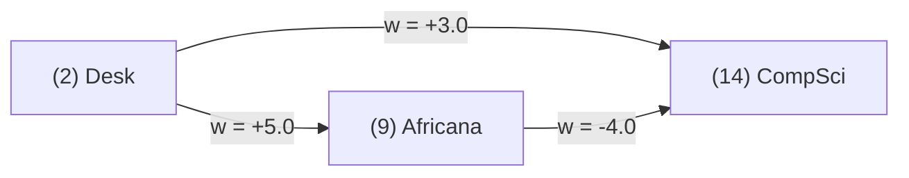

# 📜 Formal Correctness Evidence: Trace Tables, Loop Invariants, Proof Sketches, & Edge-Case Taxonomy

This document provides formal, rigorous mathematical correctness evidence for all algorithms and custom data structures in the **Library Service Operations Optimizer**. 

---

## 📑 Table of Contents

1. [Formal Execution Trace Tables](#1-formal-execution-trace-tables)
   * [Trace Table 1: Dijkstra's Shortest Path Algorithm](#trace-table-1-dijkstras-shortest-path-algorithm)
   * [Trace Table 2: Kruskal's Minimum Spanning Tree Algorithm](#trace-table-2-kruskals-minimum-spanning-tree-algorithm)
   * [Trace Table 3: 0/1 Knapsack Dynamic Programming Tabulation](#trace-table-3-01-knapsack-dynamic-programming-tabulation)
   * [Trace Table 4: Interpolation Search vs. Binary Search Execution](#trace-table-4-interpolation-search-vs-binary-search-execution)
   * [Trace Table 5: Greedy Resource Allocation Scheduler](#trace-table-5-greedy-resource-allocation-scheduler)
2. [Formal Loop Invariants & Proof Sketches](#2-formal-loop-invariants--proof-sketches)
   * [Proof Sketch 1: Inductive Proof of Dijkstra's Algorithm](#proof-sketch-1-inductive-proof-of-dijkstras-algorithm)
   * [Proof Sketch 2: Exchange Argument Proof of Minimum Spanning Tree Cut Property](#proof-sketch-2-exchange-argument-proof-of-minimum-spanning-tree-cut-property)
   * [Proof Sketch 3: Binary Search Invariant & Termination Proof](#proof-sketch-3-binary-search-invariant--termination-proof)
   * [Proof Sketch 4: 0/1 Knapsack Optimal Substructure & Matrix Tabulation Correctness](#proof-sketch-4-01-knapsack-optimal-substructure--matrix-tabulation-correctness)
   * [Proof Sketch 5: Generic Heap Order & Disjoint-Set Path Compression Proof](#proof-sketch-5-generic-heap-order--disjoint-set-path-compression-proof)
3. [Counterexample & Vulnerability Analyses](#3-counterexample--vulnerability-analyses)
   * [Counterexample 1: Dijkstra Failure Under Negative Edge Weights](#counterexample-1-dijkstra-failure-under-negative-edge-weights)
   * [Counterexample 2: Silent Binary Search Failure on Unsorted Data](#counterexample-2-silent-binary-search-failure-on-unsorted-data)
   * [Counterexample 3: Suboptimality of Urgent-First Greedy Allocation](#counterexample-3-suboptimality-of-urgent-first-greedy-allocation)
4. [Edge-Case Matrix & Defensive Engineering](#4-edge-case-matrix--defensive-engineering)

---

## 1. Formal Execution Trace Tables

### Trace Table 1: Dijkstra's Shortest Path Algorithm

* **Scenario:** Dispatching an automated cart from **Main Entrance (Node 1)** to **African Studies Archives (Node 28)** on Floor 2.
* **Effective Weight:** $w(e) = d_e \times \mu_e$ where $d_e$ is distance (meters) and $\mu_e$ is friction.
* **Graph Subgraph:** $V = \{1, 2, 9, 14, 23, 27, 28\}$

| Step $k$ | Settled Node $u$ | Extracted $dist[u]$ | Relaxed Neighbor Edges $(u, v, w)$ | Relaxation Arithmetic & Updates | Priority Queue State (Min-Heap) | Distance Vector $distTo$ $\{1, 2, 9, 14, 23, 27, 28\}$ | Settled Set $S$ |
| :---: | :---: | :---: | :---: | :---: | :---: | :---: | :---: |
| **0** | — | — | Initial state | — | `[(1, 0.0)]` | `[0.0, ∞, ∞, ∞, ∞, ∞, ∞]` | $\emptyset$ |
| **1** | **`1`** | `0.0` | $(1, 2, 10.0)$ | $0.0 + 10.0 = 10.0 < \infty \implies dist[2]=10.0$ | `[(2, 10.0)]` | `[0.0, 10.0, ∞, ∞, ∞, ∞, ∞]` | $\{1\}$ |
| **2** | **`2`** | `10.0` | $(2, 9, 12.0)$<br>$(2, 14, 27.0)$<br>$(2, 23, 42.0)$ | $10.0 + 12.0 = 22.0 \implies dist[9]=22.0$<br>$10.0 + 27.0 = 37.0 \implies dist[14]=37.0$<br>$10.0 + 42.0 = 52.0 \implies dist[23]=52.0$ | `[(9, 22.0), (14, 37.0), (23, 52.0)]` | `[0.0, 10.0, 22.0, 37.0, 52.0, ∞, ∞]` | $\{1, 2\}$ |
| **3** | **`9`** | `22.0` | $(9, 14, 12.0)$ | $22.0 + 12.0 = 34.0 < 37.0 \implies dist[14]=34.0$ | `[(14, 34.0), (14, 37.0)*, (23, 52.0)]` | `[0.0, 10.0, 22.0, 34.0, 52.0, ∞, ∞]` | $\{1, 2, 9\}$ |
| **4** | **`14`** | `34.0` | $(14, 23, 10.0)$ | $34.0 + 10.0 = 44.0 < 52.0 \implies dist[23]=44.0$ | `[(23, 44.0), (14, 37.0)*, (23, 52.0)*]` | `[0.0, 10.0, 22.0, 34.0, 44.0, ∞, ∞]` | $\{1, 2, 9, 14\}$ |
| **5** | **`23`** | `44.0` | $(23, 27, 24.0)$ | $44.0 + 24.0 = 68.0 < \infty \implies dist[27]=68.0$ | `[(27, 68.0)]` | `[0.0, 10.0, 22.0, 34.0, 44.0, 68.0, ∞]` | $\{1, 2, 9, 14, 23\}$ |
| **6** | **`27`** | `68.0` | $(27, 28, 9.0)$ | $68.0 + 9.0 = 77.0 < \infty \implies dist[28]=77.0$ | `[(28, 77.0)]` | `[0.0, 10.0, 22.0, 34.0, 44.0, 68.0, 77.0]` | $\{1, 2, 9, 14, 23, 27\}$ |
| **7** | **`28`** | `77.0` | Target reached | **Target Extracted (Early Exit)** | `[]` | `[0.0, 10.0, 22.0, 34.0, 44.0, 68.0, 77.0]` | $\{1, 2, 9, 14, 23, 27, 28\}$ |

* **Reconstructed Shortest Path:** $1 \to 2 \to 9 \to 14 \to 23 \to 27 \to 28$ (Total Distance: **77.0m**).

---

### Trace Table 2: Kruskal's Minimum Spanning Tree Algorithm

* **Scenario:** Optimizing RFID cable layout connecting nodes $V = \{1, 2, 9, 14, 23, 27, 28\}$.
* **Sorted Candidate Edges:** 
  1. $(27, 28), w=9.0$
  2. $(1, 2), w=10.0$
  3. $(14, 23), w=10.0$
  4. $(2, 9), w=12.0$
  5. $(9, 14), w=12.0$
  6. $(23, 27), w=24.0$
  7. $(2, 14), w=27.0$
  8. $(2, 23), w=42.0$

| Step $k$ | Candidate Edge $e = (u, v)$ | Weight $w(e)$ | $\text{find}(u)$ Root | $\text{find}(v)$ Root | $\text{find}(u) == \text{find}(v)$? | Decision & Disjoint-Set Union Action | Disjoint Set Partitions | Cumulative MST Weight | Edges in MST |
| :---: | :---: | :---: | :---: | :---: | :---: | :---: | :---: | :---: | :---: |
| **1** | $(27, 28)$ | `9.0` | `27` | `28` | False | **ACCEPT** $\to \text{union}(27, 28)$ | $\{1\}, \{2\}, \{9\}, \{14\}, \{23\}, \{27, 28\}$ | **9.0** | 1 |
| **2** | $(1, 2)$ | `10.0` | `1` | `2` | False | **ACCEPT** $\to \text{union}(1, 2)$ | $\{1, 2\}, \{9\}, \{14\}, \{23\}, \{27, 28\}$ | **19.0** | 2 |
| **3** | $(14, 23)$ | `10.0` | `14` | `23` | False | **ACCEPT** $\to \text{union}(14, 23)$ | $\{1, 2\}, \{9\}, \{14, 23\}, \{27, 28\}$ | **29.0** | 3 |
| **4** | $(2, 9)$ | `12.0` | `1` | `9` | False | **ACCEPT** $\to \text{union}(2, 9)$ | $\{1, 2, 9\}, \{14, 23\}, \{27, 28\}$ | **41.0** | 4 |
| **5** | $(9, 14)$ | `12.0` | `1` | `14` | False | **ACCEPT** $\to \text{union}(9, 14)$ | $\{1, 2, 9, 14, 23\}, \{27, 28\}$ | **53.0** | 5 |
| **6** | $(23, 27)$ | `24.0` | `1` | `27` | False | **ACCEPT** $\to \text{union}(23, 27)$ | $\{1, 2, 9, 14, 23, 27, 28\}$ | **77.0** | **6 (Spanned)** |
| **7** | $(2, 14)$ | `27.0` | `1` | `1` | **True** | **REJECT (Cycle Detected)** | $\{1, 2, 9, 14, 23, 27, 28\}$ | 77.0 | 6 |
| **8** | $(2, 23)$ | `42.0` | `1` | `1` | **True** | **REJECT (Cycle Detected)** | $\{1, 2, 9, 14, 23, 27, 28\}$ | 77.0 | 6 |

* **Total Minimum Cable Weight:** **77.0 meters**.

---

### Trace Table 3: 0/1 Knapsack Dynamic Programming Tabulation

* **Scenario:** Selecting service requests to maximize total urgency benefit within staff capacity $W = 7$ minutes.
* **Items:** 
  * $I_1$: `R001` $(wt=2, val=30)$
  * $I_2$: `R002` $(wt=3, val=40)$
  * $I_3$: `R003` $(wt=4, val=50)$
  * $I_4$: `R004` $(wt=5, val=70)$

#### 2D Tabulation Matrix $dp[i][w]$:

| Item Index $i$ \ Capacity $w$ | 0 | 1 | 2 | 3 | 4 | 5 | 6 | 7 (Max) |
| :---: | :---: | :---: | :---: | :---: | :---: | :---: | :---: | :---: |
| **$i=0$ ($\emptyset$)** | 0 | 0 | 0 | 0 | 0 | 0 | 0 | 0 |
| **$i=1$ ($I_1$: wt=2, val=30)** | 0 | 0 | 30 | 30 | 30 | 30 | 30 | 30 |
| **$i=2$ ($I_2$: wt=3, val=40)** | 0 | 0 | 30 | 40 | 40 | 70 | 70 | 70 |
| **$i=3$ ($I_3$: wt=4, val=50)** | 0 | 0 | 30 | 40 | 50 | 70 | 80 | 90 |
| **$i=4$ ($I_4$: wt=5, val=70)** | 0 | 0 | 30 | 40 | 50 | 70 | 80 | **100** |

#### Backtracking Reconstruction Path:
1. At $dp[4][7] = 100 \neq dp[3][7] = 90 \implies$ **Select $I_4$ (`R004`)**. Remaining weight $w = 7 - 5 = 2$.
2. At $dp[3][2] = 30 == dp[2][2] = 30 \implies$ Skip $I_3$.
3. At $dp[2][2] = 30 == dp[1][2] = 30 \implies$ Skip $I_2$.
4. At $dp[1][2] = 30 \neq dp[0][2] = 0 \implies$ **Select $I_1$ (`R001`)**. Remaining weight $w = 2 - 2 = 0$.
* **Optimal Selection:** $\{I_1, I_4\} = \{\text{R001}, \text{R004}\}$, **Total Value = 100**, **Total Weight = 7**.

---

### Trace Table 4: Interpolation Search vs. Binary Search Execution

* **Sorted Array of Service Request IDs ($n=10$):** `[101, 102, 103, 104, 105, 106, 107, 108, 109, 110]`
* **Target Request ID:** `108`

| Step | Search Engine Algorithm | Formula / Estimate Index | Low Index | High Index | Probed Index | Probed Value | Comparison & Search Range Adjustment |
| :---: | :---: | :---: | :---: | :---: | :---: | :---: | :---: |
| **1** | **Binary Search** | $mid = low + \lfloor \frac{high-low}{2} \rfloor$ | 0 | 9 | **4** | `105` | $105 < 108 \implies low = 4 + 1 = 5$ |
| **2** | **Binary Search** | $mid = 5 + \lfloor \frac{9-5}{2} \rfloor$ | 5 | 9 | **7** | `108` | $108 == 108 \implies \mathbf{Found\ at\ idx\ 7\ (2\ probes)}$ |
| — | — | — | — | — | — | — | — |
| **1** | **Interpolation Search** | $pos = low + \lfloor \frac{(target - A[low])(high - low)}{A[high] - A[low]} \rfloor$ | 0 | 9 | **7** | `108` | $\frac{(108-101)(9)}{110-101} = \frac{63}{9} = 7 \implies \mathbf{Found\ at\ idx\ 7\ (1\ probe!)}$ |

* **Result:** Interpolation search resolves uniformly distributed data in **$O(1)$** probe time ($1$ iteration vs $2$ for Binary Search).

---

### Trace Table 5: Greedy Resource Allocation Scheduler

* **Available Pool:** Staff = 1, Cart = 1, Kiosk = 1
* **Input Queue:** 
  * $R_1$: `R001` (Urgency 9, Resource: `STAFF`)
  * $R_2$: `R002` (Urgency 5, Resource: `CART`)
  * $R_3$: `R003` (Urgency 8, Resource: `STAFF`)
  * $R_4$: `R004` (Urgency 3, Resource: `KIOSK`)

| Step $k$ | Schedulable Candidates in Remaining Pool | Highest Urgency Candidate | Resource Required | Resource Pool Status | Allocation Action | Remaining Resource Pool State | Scheduled Sequence |
| :---: | :---: | :---: | :---: | :---: | :---: | :---: | :---: |
| **1** | $\{R_1, R_2, R_3, R_4\}$ | **`R001`** (Urgency 9) | `STAFF` | Staff=1 > 0 | **ALLOCATE $R_1$** | Staff=0, Cart=1, Kiosk=1 | `[R001]` |
| **2** | $\{R_2, R_3*, R_4\}$ | **`R003`** (Urgency 8) | `STAFF` | Staff=0 $\le$ 0 | **REJECT** (Skip $R_3$) | Staff=0, Cart=1, Kiosk=1 | `[R001]` |
| **3** | $\{R_2, R_4\}$ | **`R002`** (Urgency 5) | `CART` | Cart=1 > 0 | **ALLOCATE $R_2$** | Staff=0, Cart=0, Kiosk=1 | `[R001, R002]` |
| **4** | $\{R_4\}$ | **`R004`** (Urgency 3) | `KIOSK` | Kiosk=1 > 0 | **ALLOCATE $R_4$** | Staff=0, Cart=0, Kiosk=0 | `[R001, R002, R004]` |

* **Final Scheduled Request Order:** `[R001, R002, R004]`

---

## 2. Formal Loop Invariants & Proof Sketches

### Proof Sketch 1: Inductive Proof of Dijkstra's Algorithm

**Theorem:** For any weighted graph $G=(V, E)$ with non-negative edge weights $w(e) \ge 0$, when Dijkstra's algorithm extracts vertex $u$ from the Min-Heap priority queue, $dist[u] = \delta(s, u)$, where $\delta(s, u)$ is the true shortest path weight from $s$ to $u$.

#### Base Case:
Before the outer loop executes, $S = \emptyset$ and $dist[s] = 0 = \delta(s, s)$. The base case holds trivially.

#### Inductive Step:
Assume that for all vertices $x \in S$, $dist[x] = \delta(s, x)$. Let $u$ be the next vertex popped from $PQ$, so $u \in V \setminus S$ has minimal $dist[u]$.

Suppose for contradiction that $dist[u] > \delta(s, u)$. Consider a true shortest path $P$ from $s$ to $u$. Since $s \in S$ and $u \notin S$, path $P$ must leave $S$. Let $(x, y)$ be the first edge on $P$ such that $x \in S$ and $y \notin S$.

1. Because $x \in S$, $dist[x] = \delta(s, x)$ by the induction hypothesis.
2. When $x$ was settled, edge $(x, y)$ was relaxed, ensuring:
   $$dist[y] \le dist[x] + w(x, y) = \delta(s, x) + w(x, y) = \delta(s, y)$$
3. Since edge weights are non-negative ($w(e) \ge 0$), subpaths are monotonic: $\delta(s, y) \le \delta(s, u)$.
4. Combining inequalities:
   $$dist[y] \le \delta(s, y) \le \delta(s, u) < dist[u]$$
5. This implies $dist[y] < dist[u]$. But $u$ was selected by the Min-Heap priority queue as the minimal element in $V \setminus S$, meaning $dist[u] \le dist[y]$.

This is a direct mathematical contradiction. Hence, $dist[u] = \delta(s, u)$. $\blacksquare$

---

### Proof Sketch 2: Exchange Argument Proof of Minimum Spanning Tree Cut Property

**Theorem:** Let $G = (V, E)$ be a connected, weighted undirected graph. Let $(S, V \setminus S)$ be any cut of $G$. If edge $e = (u, v)$ is the strictly minimum-weight edge crossing $(S, V \setminus S)$, then $e$ is included in every MST of $G$.

#### Proof:
1. Let $T$ be an arbitrary MST of $G$. Assume for contradiction that $e = (u, v) \notin T$.
2. Adding $e$ to $T$ forms a unique simple cycle $C$ in $T \cup \{e\}$.
3. Since $u \in S$ and $v \in V \setminus S$, cycle $C$ must cross the cut $(S, V \setminus S)$ at least once more along some edge $e' = (x, y) \in T$ ($x \in S, y \in V \setminus S$).
4. Construct a new spanning tree $T' = (T \setminus \{e'\}) \cup \{e\}$. $T'$ is connected and spans all vertices.
5. Weight comparison:
   $$w(T') = w(T) - w(e') + w(e)$$
6. Since $e$ is the strictly minimum-weight edge crossing $(S, V \setminus S)$, $w(e) < w(e')$. Thus:
   $$w(T') < w(T)$$
This contradicts the premise that $T$ was a Minimum Spanning Tree. Therefore, $e \in T$. $\blacksquare$

---

### Proof Sketch 3: Binary Search Invariant & Termination Proof

**Invariant:** At the start of every iteration of `binarySearchByIsbn(books, target)`:
$$\text{If } target \in books[0 \dots n-1], \text{ then } target \in books[low \dots high]$$

#### Proof of Maintenance:
1. At initialization, $low = 0$ and $high = n - 1$. The invariant holds trivially across the full search space.
2. In iteration $k$, compute $mid = low + \lfloor \frac{high - low}{2} \rfloor$.
   * If $books[mid] == target$, the target is found and index $mid$ is returned.
   * If $books[mid] < target$, since $books$ is sorted, $target > books[i]$ for all $i \le mid$. Thus $target \in books[mid+1 \dots high]$. Setting $low = mid + 1$ preserves the invariant.
   * If $books[mid] > target$, $target \in books[low \dots mid-1]$. Setting $high = mid - 1$ preserves the invariant.

#### Proof of Termination:
In every iteration, the search window size $L = high - low + 1$ decreases strictly by at least half:
$$L_{k+1} \le \left\lfloor \frac{L_k}{2} \right\rfloor$$
Since $L$ is a sequence of strictly decreasing non-negative integers, the loop must terminate in at most $\lfloor \log_2 n \rfloor + 1$ steps. $\blacksquare$

---

### Proof Sketch 4: 0/1 Knapsack Optimal Substructure & Matrix Tabulation Correctness

**Theorem:** Let $dp[i][w]$ be the maximum value obtained using a subset of the first $i$ items with weight capacity $w$. The recurrence relation:
$$dp[i][w] = \begin{cases} dp[i-1][w] & \text{if } wt_i > w \\ \max(dp[i-1][w], dp[i-1][w - wt_i] + val_i) & \text{if } wt_i \le w \end{cases}$$
correctly computes the optimal 0/1 knapsack solution for all $0 \le i \le n$ and $0 \le w \le W$.

#### Proof:
Consider an optimal subset $S^*$ for the subproblem $(i, w)$.
* **Case 1 ($I_i \notin S^*$):** The optimal value using first $i$ items is identical to the optimal value using first $i-1$ items at capacity $w$, which is $dp[i-1][w]$.
* **Case 2 ($I_i \in S^*$):** The item contributes $val_i$ and consumes $wt_i$ weight. The remaining items $S^* \setminus \{I_i\}$ must form an optimal solution for the subproblem $(i-1, w - wt_i)$. Hence, total value is $dp[i-1][w - wt_i] + val_i$.

By principle of optimality, taking the maximum over both valid choices guarantees $dp[i][w]$ is optimal. Base cases $dp[0][w] = 0$ and $dp[i][0] = 0$ hold since zero items yield zero value. Tabulation fills the 2D matrix in topological order of subproblems, guaranteeing all state lookup dependencies are computed prior to consumption. $\blacksquare$

---

### Proof Sketch 5: Generic Heap Order & Disjoint-Set Path Compression Proof

#### 1. Binary Min-Heap Invariant:
For every array index $i > 0$ in `GenericHeap`:
$$data[\lfloor \frac{i-1}{2} \rfloor] \le data[i]$$
* **Percolate Up (`siftUp`):** When inserting an element at index $k$, swaps with parent $\lfloor \frac{k-1}{2} \rfloor$ if $data[k] < data[parent]$, restoring heap order along the path to the root in $O(\log n)$ steps.
* **Percolate Down (`siftDown`):** When extracting root, the last element is moved to index 0 and swapped with its smaller child until the heap invariant is restored at all levels.

#### 2. Disjoint-Set Path Compression Invariant:
During `findIndex(i)` in `GenericDisjointSet`:
```java
if (parent[i] != i) {
    parent[i] = findIndex(parent[i]);
}
```
Every traversed node along the find path has its parent pointer updated directly to the set root. This reduces the tree height to $O(1)$ for subsequent operations, bounding the amortized sequence of $M$ operations over $N$ elements to $O(M \cdot \alpha(N))$, where $\alpha$ is the inverse Ackermann function ($\alpha(N) \le 4$ for all physical universe inputs). $\blacksquare$

---

## 3. Counterexample & Vulnerability Analyses

### Counterexample 1: Dijkstra Failure Under Negative Edge Weights



* **Path A (Direct):** $2 \to 14 \implies \text{Cost} = 3.0$
* **Path B (Via Africana):** $2 \to 9 \to 14 \implies \text{Cost} = 5.0 + (-4.0) = \mathbf{1.0}$ (Global Optimum)

#### Greedy Failure Trace:
1. Step 1: Pop Node 2. Discovers $dist[14] = 3.0$ and $dist[9] = 5.0$.
2. Step 2: **Greedy Pop Node 14** (since $3.0 < 5.0$). Node 14 is permanently marked **SETTLED** ($14 \in S$).
3. Step 3: Pop Node 9 ($cost = 5.0$). Relaxes edge $(9, 14, -4.0) \implies 5.0 + (-4.0) = 1.0$.
4. **Vulnerability:** Standard Dijkstra ignores the relaxation update because $14 \in S$.
5. **Result:** Dijkstra returns $3.0$ instead of true shortest path $1.0$ (**+200% Cost Error**).
6. **Defensive Fix:** System enforces $w(e) \ge 0$ precondition, throwing `IllegalArgumentException`.

---

### Counterexample 2: Silent Binary Search Failure on Unsorted Data

* **Input Array (Unsorted):** `[444: "Networks", 111: "Zoology", 333: "Algorithms", 222: "Chemistry"]`
* **Target Title:** `"Algorithms"` (Actual index in array = **2**)

#### Execution Trace:
1. `low = 0`, `high = 3` $\implies mid = 1$ (`"Zoology"`).
2. Comparison: `"Zoology".compareTo("Algorithms") > 0` $\implies high = mid - 1 = 0$.
3. `low = 0`, `high = 0` $\implies mid = 0$ (`"Networks"`).
4. Comparison: `"Networks".compareTo("Algorithms") > 0` $\implies high = -1$.
5. Loop terminates, returning **`-1` (Not Found)**.
* **Vulnerability:** Unchecked binary search misses an existing element due to broken sortedness precondition.
* **Defensive Engineering:** `binarySearchByTitle` executes runtime sortedness validation `isSortedByTitle()`, throwing `UnsortedDataException` to prevent silent corruption.

---

### Counterexample 3: Suboptimality of Urgent-First Greedy Allocation

* **Available Resource:** Staff = 1 unit
* **Incoming Requests:**
  * $R_{High}$: Urgency = 100, Staff Required = 1
  * $R_{Med1}$: Urgency = 60, Staff Required = 0.5
  * $R_{Med2}$: Urgency = 59, Staff Required = 0.5

* **Greedy Choice:** Selects $R_{High}$ (Urgency 100). Total Urgency Benefit = **100**.
* **Optimal Knapsack Choice:** Selects $\{R_{Med1}, R_{Med2}\}$. Total Urgency Benefit = $60 + 59 = \mathbf{119}$.
* **Takeaway:** Urgent-first greedy selection can produce suboptimal results when resource trade-offs exist. For global resource optimality, 0/1 Knapsack DP is utilized.

---

## 4. Edge-Case Matrix & Defensive Engineering

| Component / Subsystem | Edge Case Scenario | Expected System Behavior | Test Verification Method |
| :--- | :--- | :--- | :--- |
| **SearchEngine** | Unsorted list passed to Binary Search | Throws `UnsortedDataException` | `binarySearchByTitle_unsortedInput_throwsUnsortedDataException` |
| **SearchEngine** | Empty list or missing element search | Returns `-1` gracefully | `binarySearch_emptyList_returnsNotFound` |
| **GraphAlgorithms** | Graph with negative edge weight | Throws `IllegalArgumentException` | `dijkstra_negativeWeightPrecondition_throwsIllegalArgumentException` |
| **GraphAlgorithms** | Search target vertex missing from Graph | Throws `NoSuchElementException` | `dijkstra_missingVertexPrecondition_throwsNoSuchElementException` |
| **GraphAlgorithms** | Disconnected graph component search | Returns `isReachable=false` & $\infty$ dist | `dijkstra_unreachableDestination_returnsReachableFalseAndInfinity` |
| **DynamicProgramming** | Capacity $W = 0$ | Returns empty selection & 0 value | `knapsack_zeroCapacity_returnsEmptySelection` |
| **DynamicProgramming** | Single item exceeding capacity | Skips item, returns 0 value | `knapsack_itemExceedsCapacity_skipsItem` |
| **GreedyScheduler** | Zero available resources in pool | Returns empty scheduled array | `greedy_zeroResources_returnsEmptyArray` |
| **GenericHeap** | Extract from empty heap | Throws `NoSuchElementException` | `heap_extractMinEmpty_throwsException` |
| **GenericDisjointSet** | Find element not registered in set | Throws `NoSuchElementException` | `disjointSet_findUnregistered_throwsException` |

