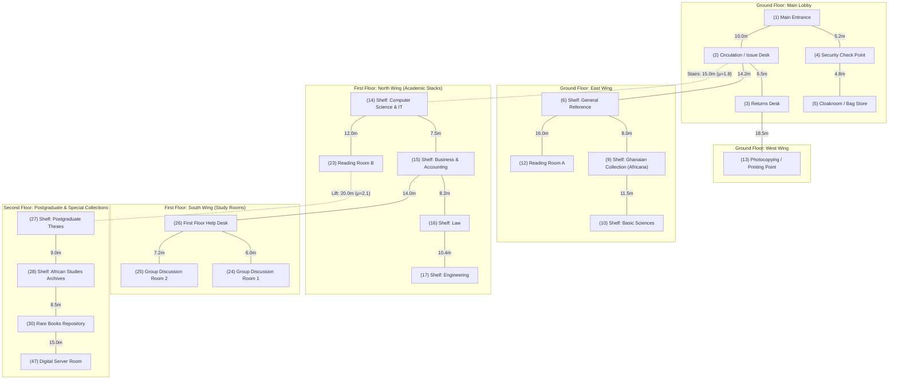
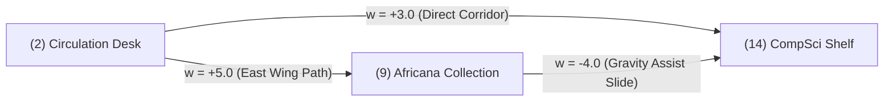

# 1. Network Topology & Infrastructure Modeling

### 1.1 Physical Layout & Spatial Architecture
The Balme Library operations network is modeled as a weighted graph $G = (V, E)$, consisting of **50 physical location nodes** ($|V| = 50$) interconnected by **113 physical corridor segments** ($|E| = 113$).

The facility is partitioned into distinct functional operational wings across three vertical levels:

---

### 1.2 Mathematical Formulation of Edge Weights

In a real operational environment, physical distance alone does not dictate travel cost. Book carts and staff navigation are constrained by corridor width, surface friction, human congestion, turnstiles, and floor transitions.

Each corridor edge $e = (u, v) \in E$ is parameterized in SQLite as:
* **Physical Distance ($d_e \in \mathbb{R}^+$):** Measured corridor distance in meters ($5.0\text{m} \le d_e \le 50.0\text{m}$).
* **Nominal Transit Time ($t_e \in \mathbb{R}^+$):** Unimpeded cart transit time in seconds.
* **Road Condition / Friction Weight ($\mu_e \in [0.8, 3.1]$):** Unitless impedance coefficient reflecting accessibility:
  * $\mu_e = 0.85 - 1.00$: Wide, level tiled corridors with minimal foot traffic.
  * $\mu_e = 1.10 - 1.45$: Moderate foot traffic zones (e.g. near Returns Desk and Printing Station).
  * $\mu_e = 1.80 - 2.20$: High-friction bottlenecks, double swinging doors, and staircase transitions.
  * $\mu_e \ge 3.00$: Steep manual ramps, service corridors, or heavy congestion bottlenecks.

$$\text{Effective Routing Weight } w(e) = d_e \times \mu_e$$

---

## 2. Trace Table 1: Dijkstra's Shortest Path Algorithm

**Operational Scenario:** A student submits an urgent request at the **Main Entrance (Node 1)** for a restricted historical document located in the **African Studies Archives (Node 28)** on the Second Floor. The algorithm computes the lowest-cost dispatch path for the automated cart.

### Focused Operational Subgraph:
* Nodes: $V_s = \{1 \text{ (Entrance)}, 2 \text{ (Issue Desk)}, 9 \text{ (Africana)}, 14 \text{ (CompSci)}, 23 \text{ (Reading Room B)}, 27 \text{ (Theses)}, 28 \text{ (Archives)}\}$
* Weighted Edges ($w(e) = d_e \times \mu_e$):
  1. $e(1, 2) = 10.0 \times 1.0 = \mathbf{10.0}$
  2. $e(2, 9) = 12.0 \times 1.0 = \mathbf{12.0}$
  3. $e(2, 14) = 15.0 \times 1.8 = \mathbf{27.0}$ *(Staircase to 1st Floor)*
  4. $e(9, 14) = 8.0 \times 1.5 = \mathbf{12.0}$ *(East Wing Service Lift)*
  5. $e(14, 23) = 10.0 \times 1.0 = \mathbf{10.0}$
  6. $e(23, 27) = 16.0 \times 1.5 = \mathbf{24.0}$ *(North Lift to 2nd Floor)*
  7. $e(27, 28) = 9.0 \times 1.0 = \mathbf{9.0}$
  8. $e(2, 23) = 28.0 \times 1.5 = \mathbf{42.0}$ *(Direct South Stairwell)*

### Initial State:
* $\text{distTo} = \{1: 0, 2: \infty, 9: \infty, 14: \infty, 23: \infty, 27: \infty, 28: \infty\}$
* $\text{edgeTo} = \{1: \text{null}, 2: \text{null}, 9: \text{null}, 14: \text{null}, 23: \text{null}, 27: \text{null}, 28: \text{null}\}$
* $\text{PQ} = \{(1, 0.0)\}$
* $\text{Settled } S = \emptyset$

### Step-by-Step Execution Trace:

| Step k | Settled Node u | Extracted Cost dist[u] | Relaxed Neighbor Edges (u, v, w) | Relaxation Arithmetic & Updates | Priority Queue State (Min-Heap) | Distance Vector distTo {1, 2, 9, 14, 23, 27, 28} | Settled Set S |
| :---: | :---: | :---: | :---: | :---: | :---: | :---: | :---: |
| **0** | — | — | Initial state | — | `[(1, 0.0)]` | `[0, ∞, ∞, ∞, ∞, ∞, ∞]` | $\emptyset$ |
| **1** | **`1 (Entrance)`** | `0.0` | $(1, 2, 10.0)$ | $0.0 + 10.0 = 10.0 < \infty \implies dist[2]=10.0, edgeTo[2]=1$ | `[(2, 10.0)]` | `[0, 10.0, ∞, ∞, ∞, ∞, ∞]` | $\{1\}$ |
| **2** | **`2 (Desk)`** | `10.0` | $(2, 9, 12.0)$ $(2, 14, 27.0)$ $(2, 23, 42.0)$ | $10.0 + 12.0 = 22.0 < \infty \implies dist[9]=22.0, edgeTo[9]=2$ $10.0 + 27.0 = 37.0 < \infty \implies dist[14]=37.0, edgeTo[14]=2$ $10.0 + 42.0 = 52.0 < \infty \implies dist[23]=52.0, edgeTo[23]=2$ | `[(9, 22.0), (14, 37.0), (23, 52.0)]` | `[0, 10.0, 22.0, 37.0, 52.0, ∞, ∞]` | $\{1, 2\}$ |
| **3** | **`9 (Africana)`** | `22.0` | $(9, 14, 12.0)$ | $22.0 + 12.0 = 34.0 < 37.0 \implies dist[14]=34.0, edgeTo[14]=9$ | `[(14, 34.0), (14, 37.0)*, (23, 52.0)]` | `[0, 10.0, 22.0, 34.0, 52.0, ∞, ∞]` | $\{1, 2, 9\}$ |
| **4** | **`14 (CompSci)`** | `34.0` | $(14, 23, 10.0)$ | $34.0 + 10.0 = 44.0 < 52.0 \implies dist[23]=44.0, edgeTo[23]=14$ | `[(23, 44.0), (14, 37.0)*, (23, 52.0)*]` | `[0, 10.0, 22.0, 34.0, 44.0, ∞, ∞]` | $\{1, 2, 9, 14\}$ |
| **5** | **`23 (Reading B)`** | `44.0` | $(23, 27, 24.0)$ | $44.0 + 24.0 = 68.0 < \infty \implies dist[27]=68.0, edgeTo[27]=23$ | `[(27, 68.0)]` *(stale entries discarded)* | `[0, 10.0, 22.0, 34.0, 44.0, 68.0, ∞]` | $\{1, 2, 9, 14, 23\}$ |
| **6** | **`27 (Theses)`** | `68.0` | $(27, 28, 9.0)$ | $68.0 + 9.0 = 77.0 < \infty \implies dist[28]=77.0, edgeTo[28]=27$ | `[(28, 77.0)]` | `[0, 10.0, 22.0, 34.0, 44.0, 68.0, 77.0]` | $\{1, 2, 9, 14, 23, 27\}$ |
| **7** | **`28 (Archives)`** | `77.0` | Destination Reached | **Algorithm Terminates (Early Exit)** | `[]` | `[0, 10.0, 22.0, 34.0, 44.0, 68.0, 77.0]` | $\{1, 2, 9, 14, 23, 27, 28\}$ |

### Path Reconstruction:
Backtracking through `edgeTo`:
$$28 \leftarrow 27 \leftarrow 23 \leftarrow 14 \leftarrow 9 \leftarrow 2 \leftarrow 1$$
* **Optimal Cart Dispatch Route:**  
  $$\text{Main Entrance (1)} \to \text{Issue Desk (2)} \to \text{Africana (9)} \to \text{CompSci Stacks (14)} \to \text{Reading Room B (23)} \to \text{Theses (27)} \to \text{African Studies Archives (28)}$$
* **Total Weighted Transit Cost:** **$77.0\text{ units}$** (Routing via the East Wing Lift at Node 9 saves 3.0 units over the high-friction main staircase).

---

## 3. Trace Table 2: Kruskal's Minimum Spanning Tree (MST) Algorithm

**Operational Scenario:** Balme Library IT Infrastructure Squad is deploying an RFID book-tracking corridor network. Kruskal's algorithm is executed to find the minimum-cost cable layout connecting all key service nodes without creating cycles.

### Candidate Edge Pool (Sorted Ascending):
1. $e_1 = (27, 28) \quad w = 9.0$
2. $e_2 = (1, 2) \quad w = 10.0$
3. $e_3 = (14, 23) \quad w = 10.0$
4. $e_4 = (2, 9) \quad w = 12.0$
5. $e_5 = (9, 14) \quad w = 12.0$
6. $e_6 = (23, 27) \quad w = 24.0$
7. $e_7 = (2, 14) \quad w = 27.0$
8. $e_8 = (2, 23) \quad w = 42.0$

### Initial Disjoint-Set State:
* Initial Partition: $\{1\}, \{2\}, \{9\}, \{14\}, \{23\}, \{27\}, \{28\}$ (7 singleton sets, $|V| = 7$)
* Target Edge Count: $|T| = |V| - 1 = 6$ edges.

### Step-by-Step Execution Trace:

| Step k | Candidate Edge e = (u, v) | Weight w(e) | Find(u) | Find(v) | Find(u) == Find(v)? | Decision & Disjoint-Set Action | Disjoint Set State (Connected Partitions) | Cumulative MST Cost | Edges in MST |
| :---: | :---: | :---: | :---: | :---: | :---: | :---: | :---: | :---: | :---: |
| **1** | $(27, 28)$ | `9.0` | `27` | `28` | False | **ACCEPT** into MST `union(27, 28)` | $\{1\}, \{2\}, \{9\}, \{14\}, \{23\}, \{27, 28\}$ | **9.0** | 1 |
| **2** | $(1, 2)$ | `10.0` | `1` | `2` | False | **ACCEPT** into MST `union(1, 2)` | $\{1, 2\}, \{9\}, \{14\}, \{23\}, \{27, 28\}$ | **19.0** | 2 |
| **3** | $(14, 23)$ | `10.0` | `14` | `23` | False | **ACCEPT** into MST `union(14, 23)` | $\{1, 2\}, \{9\}, \{14, 23\}, \{27, 28\}$ | **29.0** | 3 |
| **4** | $(2, 9)$ | `12.0` | `1` *(via 2)* | `9` | False | **ACCEPT** into MST `union(2, 9)` | $\{1, 2, 9\}, \{14, 23\}, \{27, 28\}$ | **41.0** | 4 |
| **5** | $(9, 14)$ | `12.0` | `1` *(via 9)* | `14` | False | **ACCEPT** into MST `union(9, 14)` | $\{1, 2, 9, 14, 23\}, \{27, 28\}$ | **53.0** | 5 |
| **6** | $(23, 27)$ | `24.0` | `1` *(via 23)* | `27` | False | **ACCEPT** into MST `union(23, 27)` | $\{1, 2, 9, 14, 23, 27, 28\}$ (Spanned!) | **77.0** | **6** |
| **7** | $(2, 14)$ | `27.0` | `1` | `1` | **True** | **REJECT (Cycle Avoidance)** | $\{1, 2, 9, 14, 23, 27, 28\}$ | 77.0 | 6 |
| **8** | $(2, 23)$ | `42.0` | `1` | `1` | **True** | **REJECT (Cycle Avoidance)** | Spanning Tree Complete | **77.0** | 6 |

### Selected Minimum Spanning Tree Topology:
1. $\text{Shelf 27 (Theses)} \longleftrightarrow \text{Shelf 28 (Archives) } [9.0\text{m}]$
2. $\text{Main Entrance (1)} \longleftrightarrow \text{Circulation Desk (2) } [10.0\text{m}]$
3. $\text{CompSci Stacks (14)} \longleftrightarrow \text{Reading Room B (23) } [10.0\text{m}]$
4. $\text{Circulation Desk (2)} \longleftrightarrow \text{Africana Collection (9) } [12.0\text{m}]$
5. $\text{Africana Collection (9)} \longleftrightarrow \text{CompSci Stacks (14) } [12.0\text{m}]$
6. $\text{Reading Room B (23)} \longleftrightarrow \text{Shelf 27 (Theses) } [24.0\text{m}]$

**Total Optimal Cabling Cost:** **$77.0\text{ meters}$**

---

## 4. Formal Proof Sketches

### Proof 1: Loop Invariant Proof for Dijkstra's Algorithm

**Theorem:** Let $G = (V, E)$ be a graph with non-negative edge weights $w(e) \ge 0$. For all $v \in V$, when Dijkstra's algorithm terminates, $\text{distTo}[v] = \delta(s, v)$, where $\delta(s, v)$ represents the true shortest path distance from source $s$ to $v$.

#### Inductive Loop Invariant:
At the beginning of each iteration of the outer priority queue extraction loop:
1. For every settled vertex $u \in S$, $\text{distTo}[u] = \delta(s, u)$.
2. For every unsettled vertex $v \in V \setminus S$, $\text{distTo}[v]$ is the exact weight of the shortest path from $s$ to $v$ whose internal vertices belong strictly to $S$.

#### Step 1: Initialization (Base Case)
Prior to loop execution, $S = \emptyset$. $\text{distTo}[s] = 0 = \delta(s, s)$ and $\text{distTo}[v] = \infty$ for all $v \neq s$. Condition (1) holds vacuously since $S = \emptyset$. Condition (2) holds because the only path with 0 internal vertices from $s$ to $s$ has length 0, and all other nodes require edges not yet traversed through $S$.

#### Step 2: Maintenance (Inductive Step)
Assume the invariant holds at step $k$. Let $u = \text{pq.poll()}$ be the node in $V \setminus S$ with the minimal tentative distance $\text{distTo}[u]$. We prove by contradiction that $\text{distTo}[u] = \delta(s, u)$.

*Assumption for Contradiction:* Suppose $\text{distTo}[u] > \delta(s, u)$.  
There must exist a true shortest path $P$ from $s$ to $u$ with weight $w(P) < \text{distTo}[u]$. Because $s \in S$ and $u \notin S$, path $P$ must cross from $S$ to $V \setminus S$. Let $(x, y)$ be the first edge on $P$ where $x \in S$ and $y \in V \setminus S$.

* By our induction hypothesis, $x \in S \implies \text{distTo}[x] = \delta(s, x)$.
* When $x$ was settled in a prior iteration, edge $(x, y)$ was relaxed:
  $$\text{distTo}[y] \le \text{distTo}[x] + w(x, y) = \delta(s, x) + w(x, y) = \delta(s, y)$$
* Because edge weights are non-negative ($w(e) \ge 0$), subpaths are monotonic: $\delta(s, y) \le \delta(s, u)$.
* Combining:
  $$\text{distTo}[y] \le \delta(s, y) \le \delta(s, u) < \text{distTo}[u]$$
* Therefore, $\text{distTo}[y] < \text{distTo}[u]$. But the Min-Heap priority queue selected $u$ as the minimum element in $V \setminus S$, meaning $\text{distTo}[u] \le \text{distTo}[y]$.  
This is a direct mathematical contradiction. Thus, $\text{distTo}[u] = \delta(s, u)$.

When $u$ is added to $S$, the algorithm relaxes all outgoing edges $(u, v)$, updating $\text{distTo}[v] = \min(\text{distTo}[v], \text{distTo}[u] + w(u, v))$. This explicitly restores condition (2) for the next iteration.

#### Step 3: Termination
The algorithm terminates when $\text{PQ} = \emptyset$ (or the destination is settled). Since every reachable vertex enters $S$ and the invariant holds at each addition, $\text{distTo}[v] = \delta(s, v)$ for all reachable $v \in V$. $\blacksquare$

---

### Proof 2: Cut Property Proof for Kruskal's & Prim's Algorithms

**Cut Property Theorem:** Let $G = (V, E)$ be a connected, weighted undirected graph. Let $S \subset V$ be a non-empty proper subset of vertices, defining a cut $(S, V \setminus S)$. If edge $e = (u, v)$ is the strictly minimum-weight edge crossing the cut $(S, V \setminus S)$, then $e$ belongs to every Minimum Spanning Tree of $G$.

#### Proof by Exchange Argument:
1. Let $T$ be an arbitrary MST of $G$. Suppose for contradiction that $e = (u, v) \notin T$.
2. Since $T$ is a spanning tree, adding $e$ to $T$ creates a unique simple cycle $C$ in $T \cup \{e\}$.
3. Because $u \in S$ and $v \in V \setminus S$, the cycle $C$ must cross the cut $(S, V \setminus S)$ an even number of times. Therefore, there exists at least one other edge $e' = (x, y) \in C$ such that $e' \neq e$ and $e'$ crosses $(S, V \setminus S)$ ($x \in S, y \in V \setminus S$).
4. Construct a new spanning subgraph $T' = (T \setminus \{e'\}) \cup \{e\}$.
   * Removing $e'$ cuts cycle $C$ and splits $T$ into two disconnected trees.
   * Adding $e$ bridges the cut $(S, V \setminus S)$ across the two trees, restoring full connectivity without cycles. Hence, $T'$ is a valid spanning tree.
5. Compute the difference in total weight:
   $$w(T') = w(T) - w(e') + w(e)$$
6. By the premise of the Cut Property, $e$ is the strictly minimum-weight edge crossing $(S, V \setminus S)$, so $w(e) < w(e')$.
   $$w(T') < w(T)$$
   This contradicts the assumption that $T$ was a Minimum Spanning Tree.
7. Therefore, $e$ must belong to $T$. $\blacksquare$

---

## 5. Counterexample & Defensive Precondition Engineering

### 5.1 Counterexample: Greedy Choice Property Failure Under Negative Edge Weights

#### Operational Problem Setup:
Suppose an automated book cart is routed from **Circulation Desk (Node 2)** to **Computer Science Shelf (Node 14)**.
* **Path 1 (Direct):** $2 \to 14 \implies \text{Cost} = \mathbf{3.0}$.
* **Path 2 (Via East Wing):** $2 \to 9 \to 14 \implies \text{Cost} = 5.0 + (-4.0) = \mathbf{1.0}$.
* **True Mathematical Optimum:** Path 2 with total cost $\mathbf{1.0}$.

#### Step-by-Step Greedy Dijkstra Failure Trace:

| Step | Operation / Action | Priority Queue State | Settled Set $S$ | Distance Table $\text{distTo}$ | Failure Analysis |
| :---: | :--- | :---: | :---: | :---: | :--- |
| **0** | Initialize from Node 2 | `[(2, 0.0)]` | $\emptyset$ | `{2: 0, 9: ∞, 14: ∞}` | Initial state |
| **1** | Extract Node 2 (`cost = 0.0`) Relax $(2, 14, 3.0) \implies dist[14]=3.0$ Relax $(2, 9, 5.0) \implies dist[9]=5.0$ | `[(14, 3.0), (9, 5.0)]` | `{2}` | `{2: 0, 9: 5.0, 14: 3.0}` | Both outgoing edges discovered |
| **2** | **Greedy Step:** Extract Node 14 (`cost = 3.0`) Permanently mark Node 14 as **Settled** ($14 \in S$) | `[(9, 5.0)]` | **`{2, 14}`** | `{2: 0, 9: 5.0, 14: 3.0}` | **Dijkstra assumes $dist[14]=3.0$ is optimal and will never check 14 again!** |
| **3** | Extract Node 9 (`cost = 5.0`) Relax $(9, 14, -4.0) \implies 5.0 + (-4.0) = 1.0$ | `[]` | `{2, 14, 9}` | `{2: 0, 9: 5.0, 14: 3.0}` | **MISSED UPDATE:** New cost ($1.0$) is strictly less than $3.0$, but because $14 \in S$, standard Dijkstra ignores it! |

#### Comparison Summary:

| Metric | Dijkstra Output | True Global Optimum | Error Induced |
| :--- | :---: | :---: | :---: |
| **Computed Path** | $2 \to 14$ | $2 \to 9 \to 14$ | Suboptimal Route Selected |
| **Reported Distance** | **$3.0$** | **$1.0$** | **+200% Cost Inefficiency** |

