# 8. Empirical Performance Analysis & Algorithmic Benchmarks

## 8.1 Benchmarking Methodology & Environment Setup
The empirical performance evaluation of the Library Service Optimizer algorithm suite was conducted under controlled execution conditions. Timings were captured in nanoseconds using high-resolution JVM system calls (`System.nanoTime()`), and memory overhead was computed using runtime memory delta diagnostics (`Runtime.getRuntime().totalMemory() - Runtime.getRuntime().freeMemory()`).

* **Execution Runtime Environment:** OpenJDK Java 17 LTS / SQLite 3.36 JDBC Driver
* **Timer Resolution:** `System.nanoTime()` (nanosecond precision)
* **Tested Input Sizes ($N$):** $N = 100$, $N = 1,000$, and $N = 10,000$ elements / graph nodes
* **Database Table:** `algorithm_runs` in `library.db`

---

## 8.2 Raw Empirical Results Table

The table below compiles raw execution times (nanoseconds and milliseconds) and memory usage (kilobytes) extracted directly from the `algorithm_runs` table across all 12 implemented algorithms:

| Run ID | Category | Algorithm Name | Input Size ($N$) | Time (ns) | Time (ms) | Memory (KB) | Asymptotic Complexity |
| :---: | :--- | :--- | :---: | :---: | :---: | :---: | :---: |
| **1** | Searching | `linear_search` | 100 | $1,034,051$ | $1.034\text{ ms}$ | $19.19\text{ KB}$ | $O(N)$ |
| **2** | Searching | `linear_search` | 1,000 | $9,420,791$ | $9.421\text{ ms}$ | $142.94\text{ KB}$ | $O(N)$ |
| **3** | Searching | `linear_search` | 10,000 | $99,301,148$ | $99.301\text{ ms}$ | $2,072.79\text{ KB}$ | $O(N)$ |
| **4** | Searching | `binary_search` | 100 | $295,623$ | $0.296\text{ ms}$ | $33.40\text{ KB}$ | $O(\log N)$ |
| **5** | Searching | `binary_search` | 1,000 | $532,398$ | $0.532\text{ ms}$ | $266.00\text{ KB}$ | $O(\log N)$ |
| **6** | Searching | `binary_search` | 10,000 | $658,759$ | **$0.659\text{ ms}$** | $1,752.29\text{ KB}$ | $O(\log N)$ |
| **7** | Sorting | `selection_sort` | 100 | $4,880,391$ | $4.880\text{ ms}$ | $11.61\text{ KB}$ | $O(N^2)$ |
| **8** | Sorting | `selection_sort` | 1,000 | $543,229,981$ | $543.230\text{ ms}$ | $252.90\text{ KB}$ | $O(N^2)$ |
| **9** | Sorting | `selection_sort` | 10,000 | $45,899,241,925$ | **$45,899.242\text{ ms}$** | $2,610.01\text{ KB}$ | $O(N^2)$ |
| **10** | Sorting | `insertion_sort` | 100 | $4,744,227$ | $4.744\text{ ms}$ | $14.17\text{ KB}$ | $O(N^2)$ |
| **11** | Sorting | `insertion_sort` | 1,000 | $304,603,361$ | $304.603\text{ ms}$ | $203.23\text{ KB}$ | $O(N^2)$ |
| **12** | Sorting | `insertion_sort` | 10,000 | $34,267,175,452$ | **$34,267.175\text{ ms}$** | $3,122.00\text{ KB}$ | $O(N^2)$ |
| **13** | Sorting | `merge_sort` | 100 | $2,415,182$ | $2.415\text{ ms}$ | $8.52\text{ KB}$ | $O(N \log N)$ |
| **14** | Sorting | `merge_sort` | 1,000 | $48,527,658$ | $48.528\text{ ms}$ | $123.42\text{ KB}$ | $O(N \log N)$ |
| **15** | Sorting | `merge_sort` | 10,000 | $550,422,283$ | **$550.422\text{ ms}$** | $2,138.77\text{ KB}$ | $O(N \log N)$ |
| **16** | Sorting | `quicksort` | 100 | $1,719,310$ | $1.719\text{ ms}$ | $15.67\text{ KB}$ | $O(N \log N)$ |
| **17** | Sorting | `quicksort` | 1,000 | $29,227,075$ | $29.227\text{ ms}$ | $95.32\text{ KB}$ | $O(N \log N)$ |
| **18** | Sorting | `quicksort` | 10,000 | $389,972,886$ | **$389.973\text{ ms}$** | $3,492.05\text{ KB}$ | $O(N \log N)$ |
| **19** | Traversal | `bfs` | 100 | $2,279,091$ | $2.279\text{ ms}$ | $16.87\text{ KB}$ | $O(V + E)$ |
| **20** | Traversal | `bfs` | 1,000 | $24,854,869$ | $24.855\text{ ms}$ | $277.62\text{ KB}$ | $O(V + E)$ |
| **21** | Traversal | `bfs` | 10,000 | $231,641,390$ | **$231.641\text{ ms}$** | $1,797.92\text{ KB}$ | $O(V + E)$ |
| **22** | Traversal | `dfs` | 100 | $2,156,455$ | $2.156\text{ ms}$ | $11.14\text{ KB}$ | $O(V + E)$ |
| **23** | Traversal | `dfs` | 1,000 | $20,424,564$ | $20.425\text{ ms}$ | $212.13\text{ KB}$ | $O(V + E)$ |
| **24** | Traversal | `dfs` | 10,000 | $178,480,841$ | **$178.481\text{ ms}$** | $1,947.60\text{ KB}$ | $O(V + E)$ |
| **25** | Shortest Path | `dijkstra` | 100 | $4,113,037$ | $4.113\text{ ms}$ | $11.41\text{ KB}$ | $O(E \log V)$ |
| **26** | Shortest Path | `dijkstra` | 1,000 | $73,276,164$ | $73.276\text{ ms}$ | $195.51\text{ KB}$ | $O(E \log V)$ |
| **27** | Shortest Path | `dijkstra` | 10,000 | $1,050,059,953$ | **$1,050.060\text{ ms}$** | $1,754.39\text{ KB}$ | $O(E \log V)$ |
| **28** | MST | `prim_mst` | 100 | $4,638,643$ | $4.639\text{ ms}$ | $30.70\text{ KB}$ | $O(E \log V)$ |
| **29** | MST | `prim_mst` | 1,000 | $70,153,846$ | $70.154\text{ ms}$ | $93.79\text{ KB}$ | $O(E \log V)$ |
| **30** | MST | `prim_mst` | 10,000 | $1,100,535,370$ | **$1,100.535\text{ ms}$** | $1,810.66\text{ KB}$ | $O(E \log V)$ |
| **31** | MST | `kruskal_mst` | 100 | $4,999,567$ | $5.000\text{ ms}$ | $22.12\text{ KB}$ | $O(E \log E)$ |
| **32** | MST | `kruskal_mst` | 1,000 | $74,966,722$ | $74.967\text{ ms}$ | $120.75\text{ KB}$ | $O(E \log E)$ |
| **33** | MST | `kruskal_mst` | 10000 | $703,105,907$ | **$703.106\text{ ms}$** | $2,335.92\text{ KB}$ | $O(E \log E)$ |
| **34** | Optimization | `knapsack_dp` | 100 | $60,090,846$ | $60.091\text{ ms}$ | $27.02\text{ KB}$ | $O(N \cdot W)$ |
| **35** | Optimization | `knapsack_dp` | 1,000 | $799,482,471$ | $799.482\text{ ms}$ | $235.97\text{ KB}$ | $O(N \cdot W)$ |
| **36** | Optimization | `knapsack_dp` | 10,000 | $5,078,141,009$ | **$5,078.141\text{ ms}$** | $2,353.71\text{ KB}$ | $O(N \cdot W)$ |

---

## 8.3 Performance Visualization & Comparative Scaling

### 8.3.1 Searching Performance: Linear Search vs Binary Search

```mermaid
gantt
    title Execution Time at N=10,000 (Lower is Better)
    dateFormat X
    axisFormat %s ms
    section Searching
    Binary Search (0.66ms)  :active, 0, 1
    Linear Search (99.30ms) :crit, 0, 99
```

### 8.3.2 Sorting Performance Divergence ($O(N^2)$ vs $O(N \log N)$)
* **$N = 100$**: Selection Sort ($4.88\text{ms}$), Insertion Sort ($4.74\text{ms}$), Merge Sort ($2.42\text{ms}$), Quicksort ($1.72\text{ms}$).
* **$N = 10,000$**: Selection Sort ($45,899\text{ms}$ ~ $45.9\text{s}$) and Insertion Sort ($34,267\text{ms}$ ~ $34.3\text{s}$) degrade exponentially compared to Quicksort ($390\text{ms}$) and Merge Sort ($550\text{ms}$).

---

## 8.4 Empirical Interpretation & Operational Recommendations

1. **Service Request Prioritization (Sorting):**
   * **Finding:** Quicksort ($389.97\text{ms}$) outperforms Merge Sort ($550.42\text{ms}$) for sorting large batches of pending service requests ($N=10,000$) due to superior cache locality and lower constant factors.
   * **Recommendation:** Use **Quicksort** as the primary sorting engine for batch queue management, using **Insertion Sort** only for small sub-arrays ($N \le 16$).

2. **Catalog Book Lookup (Searching):**
   * **Finding:** Binary Search ($0.659\text{ms}$ at $N=10,000$) provides a **$150\times$ speedup** over Linear Search ($99.301\text{ms}$).
   * **Recommendation:** Enforce indexed sorted arrays or binary search trees for ISBN and Book Title searches across the library database.

3. **Cart Routing & Infrastructure (Graphs & MST):**
   * **Finding:** Kruskal's MST ($703.11\text{ms}$) outperforms Prim's algorithm ($1,100.54\text{ms}$) on sparse network graphs ($|E| \ll |V|^2$), while Dijkstra's Algorithm ($1,050.06\text{ms}$) provides efficient real-time single-source shortest path routing across 50 location nodes.
