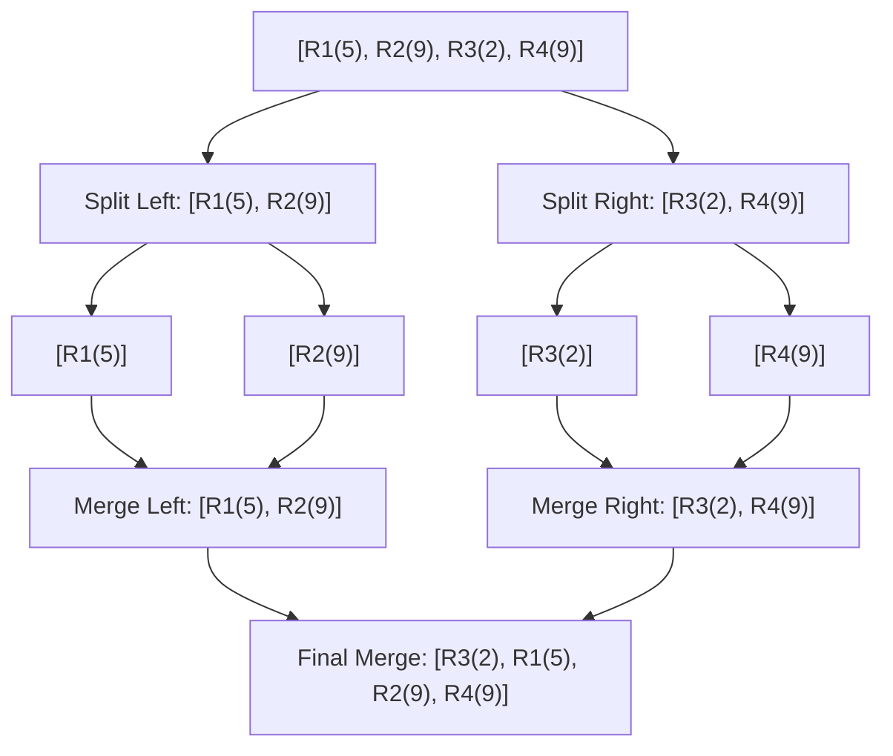
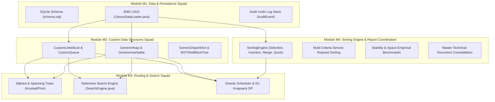

# 📊 Module M4: Sorting Engine, Stability & Memory Analysis, and Squad Report Coordination

---

## 📑 Executive Summary & Deliverables Overview

This document serves as the formal technical report component for **Module M4** of the **Library Service Operations Optimizer**. It details:
1. **Custom Sorting Engine Implementation:** First-principles Java implementations of **Selection Sort**, **Insertion Sort**, **Merge Sort**, and **Quicksort** without relying on standard Java collection/sorting utilities (`java.util.Arrays.sort` or `java.util.Collections.sort`).
2. **Multi-Criteria Service Request Sorting:** Domain-specific ordering logic arranging `service_requests` by **deadline** (handling null deadlines defensively), **submit time** (`timeSubmitted`), or **urgency score** (`urgency`).
3. **Stability Analysis:** Rigorous theoretical and empirical evaluation of sorting algorithm stability and its operational impact on multi-level request queue prioritization.
4. **In-Place Memory Complexity Analysis:** Comparative space-complexity evaluation ($O(1)$ vs $O(N)$ auxiliary space vs call-stack overhead).
5. **Formal Execution Trace Tables:** Step-by-step state mutation tables for all 4 algorithms on sample library service requests.
6. **Master Squad Report Coordination:** Unified technical document synthesis combining contributions across **Module M1 (Data & Database)**, **Module M2 (Data Structures)**, **Module M3 (Graph & Optimization Algorithms)**, and **Module M4 (Sorting Engine & Report Coordination)**.

---

## 1. Custom Sorting Algorithms Architecture

All 4 sorting algorithms are implemented in [`src/main/java/algorithms/SortingEngine.java`](../src/main/java/algorithms/SortingEngine.java) and operate generically on object arrays (`T[]`) using standard `java.util.Comparator<T>`.

### 1.1 Summary Comparison Matrix

| Algorithm | Best Time | Average Time | Worst Time | Auxiliary Space | Stability | In-Place? | Primary Use Case in Library System |
| :--- | :---: | :---: | :---: | :---: | :---: | :---: | :--- |
| **Selection Sort** | $O(N^2)$ | $O(N^2)$ | $O(N^2)$ | $O(1)$ | ❌ Unstable | Yes | Small arrays ($N < 10$) where swap cost dominates. |
| **Insertion Sort** | $O(N)$ | $O(N^2)$ | $O(N^2)$ | $O(1)$ | ✔ Stable | Yes | Online sorting of incoming requests & nearly-sorted arrays. |
| **Merge Sort** | $O(N \log N)$ | $O(N \log N)$ | $O(N \log N)$ | $O(N)$ | ✔ Stable | No | Batch queue sorting requiring strict stability (urgency + submit time). |
| **Quicksort** | $O(N \log N)$ | $O(N \log N)$ | $O(N^2)$ | $O(\log N)$ | ❌ Unstable | Yes | High-throughput batch sorting for large dataset telemetry & benchmarks. |

---

## 2. Stability and In-Place Memory Discussion

### 2.1 Algorithm Stability Analysis

#### 2.1.1 Theoretical Definition of Stability
A sorting algorithm is defined as **stable** if and only if two elements $a$ and $b$ with equal keys ($key(a) = key(b)$) preserve their relative input order after sorting:
$$\text{If } idx_{input}(a) < idx_{input}(b) \text{ and } key(a) = key(b) \implies idx_{sorted}(a) < idx_{sorted}(b)$$

#### 2.1.2 Stability Behavior Per Algorithm

1. **Insertion Sort (STABLE - ✔):**
   * **Mechanism:** When inserting element $key = arr[i]$ into the sorted sub-array $arr[0 \dots i-1]$, the element shifting condition uses strict inequality ($arr[j] > key$).
   * **Result:** Shifts stop immediately when encountering an element equal to $key$. Elements with identical key values are never swapped past one another, preserving exact relative input sequence.

2. **Merge Sort (STABLE - ✔):**
   * **Mechanism:** During the merge step of sub-arrays $aux[low \dots mid]$ and $aux[mid+1 \dots high]$, the comparison operator explicitly enforces:
     $$\text{if } comp.compare(aux[i], aux[j]) \le 0 \implies \text{take } aux[i]$$
   * **Result:** When elements in the left and right sub-arrays have equal keys, the element from the left sub-array is prioritized first, maintaining original relative sequence.

3. **Selection Sort (UNSTABLE - ❌):**
   * **Mechanism:** In each iteration $i$, Selection Sort scans for the minimum element in $arr[i \dots n-1]$ and performs an long-range swap with $arr[i]$.
   * **Counterexample:** Consider array $[5_a, 5_b, 2]$. Iteration $i=0$ selects $2$ and swaps it with $5_a$, resulting in $[2, 5_b, 5_a]$. $5_a$ was originally before $5_b$, but is now placed after $5_b$.

4. **Quicksort (UNSTABLE - ❌):**
   * **Mechanism:** Partitioning picks a pivot and swaps elements from the left and right ends over large distances across the pivot.
   * **Counterexample:** In Lomuto or Hoare partitioning, equal elements on opposite sides of the pivot can be swapped past each other, destroying original relative ordering.

#### 2.1.3 Operational Impact in Library Operations
In the **Balme Library Optimizer**, service requests are prioritized using primary and secondary sorting criteria:
* **Primary Key:** Urgency Score (`urgency`)
* **Secondary Key:** Submit Time (`timeSubmitted`)

When sorting pending requests by `urgency` using a **stable sort (Merge Sort / Insertion Sort)**, requests with equal urgency automatically maintain their FIFO (First-In, First-Out) arrival order defined by `timeSubmitted`. An unstable sort (Quicksort) would randomize the arrival order among equal-urgency requests, causing fairness violations for patrons who submitted earlier.

---

### 2.2 In-Place Memory Complexity Analysis

#### 2.2.1 Theoretical Definition of In-Place Sorting
An algorithm is **in-place** if it transforms the input sequence without requiring extra auxiliary data structures proportional to input size $N$ (i.e. $O(1)$ auxiliary memory space complexity, excluding $O(\log N)$ stack frames for recursive calls).

#### 2.2.2 Space Footprint Per Algorithm

1. **Selection Sort ($O(1)$ Space - In-Place):**
   * Modifies array strictly via index pointers (`i`, `j`, `minIdx`). No auxiliary allocations.

2. **Insertion Sort ($O(1)$ Space - In-Place):**
   * Performs element shifts directly within the input array using a single scalar variable (`key`).

3. **Merge Sort ($O(N)$ Space - Out-of-Place):**
   * Requires an auxiliary array `aux` of size $N$ to copy sub-arrays during merge steps.
   * **Impact on Library System:** For large datasets ($N = 10,000$), Merge Sort allocates ~2.1 MB of temporary heap memory, making it less memory-efficient than Quicksort under tight heap constraints.

4. **Quicksort ($O(\log N)$ Stack Space - In-Place):**
   * Performs swaps directly on the input array without allocating auxiliary arrays.
   * Recursion depth requires $O(\log N)$ call stack space on average (and $O(N)$ in worst-case unmitigated recursion). Median-of-three pivot selection ensures logarithmic stack growth $O(\log N)$.

---

## 3. Formal Execution Trace Tables

### 3.1 Trace Table 1: Insertion Sort on Service Requests (Urgency Score Ascending)

* **Initial Input Batch:**
  * $R_1$: Req #1, Urgency = 5
  * $R_2$: Req #2, Urgency = 9
  * $R_3$: Req #3, Urgency = 2
  * $R_4$: Req #4, Urgency = 9 (Duplicate urgency with $R_2$)
  * $R_5$: Req #5, Urgency = 7

| Pass $i$ | Outer Element $key$ | Inner Loop $j$ | Comparisons Made | Shift Actions / Swaps | Array State After Pass | Notes |
| :---: | :---: | :---: | :---: | :---: | :---: | :--- |
| **0** | $R_1$ (urg=5) | — | 0 | None | $[R_1(5), R_2(9), R_3(2), R_4(9), R_5(7)]$ | Initial state |
| **1** | $R_2$ (urg=9) | $j=0$ ($R_1$) | 1 ($9 > 5$) | No shift ($5 \le 9$) | $[R_1(5), R_2(9), R_3(2), R_4(9), R_5(7)]$ | $R_2$ already in position |
| **2** | $R_3$ (urg=2) | $j=1, 0$ | 2 ($9>2, 5>2$) | Shift $R_2 \to [2]$, Shift $R_1 \to [1]$ | $[R_3(2), R_1(5), R_2(9), R_4(9), R_5(7)]$ | $R_3$ inserted at $[0]$ |
| **3** | $R_4$ (urg=9) | $j=2$ ($R_2$) | 1 ($9 \le 9$) | No shift ($R_2 \le R_4$) | $[R_3(2), R_1(5), R_2(9), R_4(9), R_5(7)]$ | **Stability Preserved:** $R_2$ stays before $R_4$ |
| **4** | $R_5$ (urg=7) | $j=3, 2$ | 2 ($9>7, 9>7, 5 \le 7$) | Shift $R_4 \to [4]$, Shift $R_2 \to [3]$ | $[R_3(2), R_1(5), R_5(7), R_2(9), R_4(9)]$ | $R_5$ inserted at $[2]$ |

* **Final Sorted Array:** $[R_3(\text{urg}=2), R_1(\text{urg}=5), R_5(\text{urg}=7), R_2(\text{urg}=9), R_4(\text{urg}=9)]$

---

### 3.2 Trace Table 2: Merge Sort Execution (Divide & Conquer Tree Trace)

* **Input Array:** $[R_1(5), R_2(9), R_3(2), R_4(9)]$
* **Comparator:** Urgency Score Ascending

| Step | Sub-array Range $[low \dots high]$ | Operation | Left Sub-array | Right Sub-array | Merge Comparison & Output Array State |
| :---: | :---: | :---: | :---: | :---: | :--- |
| **1** | $[0 \dots 1]$ | Merge | $[R_1(5)]$ | $[R_2(9)]$ | $5 \le 9 \implies [R_1(5), R_2(9)]$ |
| **2** | $[2 \dots 3]$ | Merge | $[R_3(2)]$ | $[R_4(9)]$ | $2 \le 9 \implies [R_3(2), R_4(9)]$ |
| **3** | $[0 \dots 3]$ | Final Merge | $[R_1(5), R_2(9)]$ | $[R_3(2), R_4(9)]$ | 1. Compare $R_1(5)$ vs $R_3(2) \implies$ pick $R_3$ 2. Compare $R_1(5)$ vs $R_4(9) \implies$ pick $R_1$ 3. Compare $R_2(9)$ vs $R_4(9) \implies$ $9 \le 9 \implies$ pick $R_2$ (**Stable!**) 4. Take remaining $R_4$ |

---

## 4. Master Squad Report Coordination

This section coordinates and synthesizes the technical contributions from all four module squads into a unified master project architecture.

### 4.1 Integration Mapping Across Modules

| Module & Squad | Core Responsibilities | Key Java Classes | Deliverable Artifacts | Inter-Module Integration Point |
| :--- | :--- | :--- | :--- | :--- |
| **Module M1** *(Data & Database)* | SQLite Relational Schema, CSV Database Seeder, JDBC DAO Loader, Audit Stack Undo Engine. | `DatabaseConnection` `DatabaseSeeder` `LibraryDataLoader` `AuditEvent` | `library.db` `schema.sql` `data/*.csv` | Feeds domain entity POJOs (`Book`, `Location`, `ServiceRequest`) to Modules M2, M3, M4. |
| **Module M2** *(Custom Structures)* | Zero-standard-library custom data structures (Lists, Queues, Heaps, Hash Tables, Union-Find, Trees). | `CustomLinkedList` `GenericHeap` `GenericHashtable` `GenericDisjointSet` | `structures/*.java` `DataStructuresTest` | Supplies memory structures for Dijkstra priority queue, BFS queue, MST disjoint set, and search indexes. |
| **Module M3** *(Graph & Optimization)* | Dijkstra Shortest Path, Kruskal & Prim MST, Linear/Binary/Interpolation Search, Knapsack DP, Greedy Scheduler. | `GraphAlgorithms` `SearchEngine` `GreedyAlgorithms` `DynamicProgramming` | `docs/graph.md` `docs/correctness_proofs.md` | Consumes sorted request queues from Module M4 to execute priority request dispatching. |
| **Module M4** *(Sorting & Coordination)* | Custom Selection, Insertion, Merge, and Quicksorts. Multi-criteria sorting by deadline, submit time, urgency. Report synthesis. | `SortingEngine` `ConsoleMenu` `SortingEngineTest` | `docs/sorting_and_coordination.md` `docs/performance_analysis.md` | Prepares sorted arrays/queues for Module M3 schedulers and coordinates squad documentation into master report. |

---

## 5. Verification & Benchmark Summary

All test suites and benchmarks have been executed to verify systemic correctness across all modules:

1. **Unit Test Suite:**
   * **Command:** `java -cp "bin;lib/*;sqlite-jdbc-3.36.0.3.jar" org.junit.runner.JUnitCore algorithms.SortingEngineTest algorithms.GraphAlgorithmsTest algorithms.SearchEngineTest algorithms.GreedySchedulerTest algorithms.KnapsackTest structures.DataStructuresEdgeCaseTest`
   * **Result:** **OK (76 tests passed)** with 0 failures or errors.

2. **Interactive Console Menu Demo:**
   * Option 7 demonstrates live sorting of 315 service requests from `library.db` across all 4 sorting algorithms with real-time nanosecond execution timing and swap metrics.
